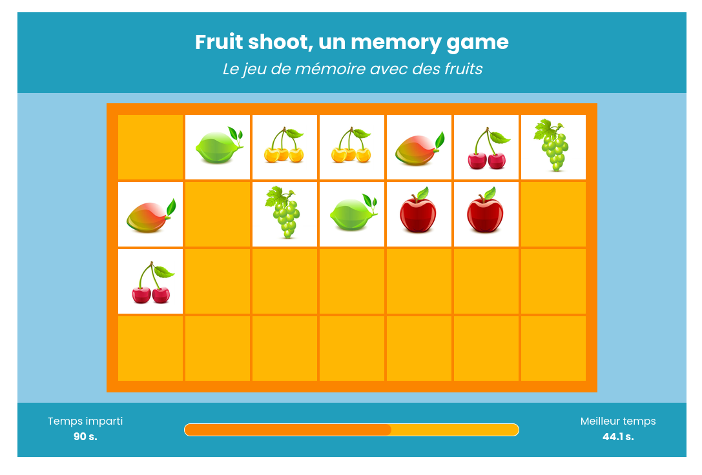
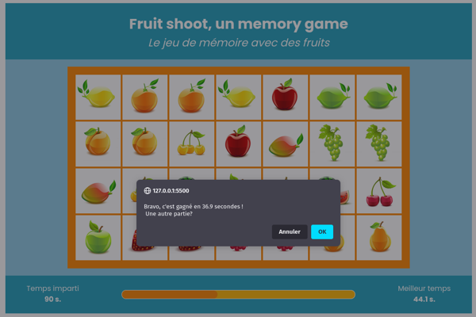
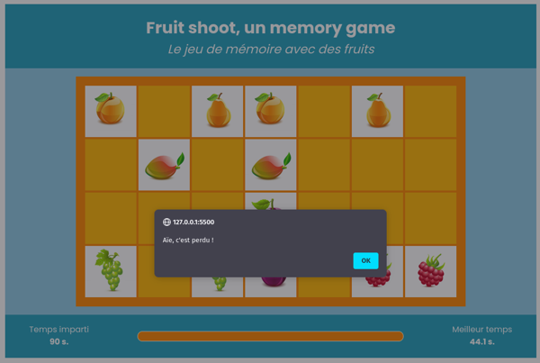

# 🎮 Fruit shoot, un jeu de memory fruité 🎮 

Il 'agit ici d'un jeu de memory dans un temps limité : il faut retrouver les paires de fruits avant que la barre du temps ne soit remplie!

## Comment jouer

- Cliquez sur une carte dont la face est cachée pour voir apparaitre un fruit.
- Cliquez sur une seconde carte pour voir apparaitre un autre fruit.
- Si les deux fruits correspondent : il y a une paire, vous pouvez continuer
- Si les fruits ne correspondent pas, les deux cartes se retournent face cachée et vous pouvez continuer à chercher

La partie est gagnée si toutes les paires ont été trouvées avant la fin du temps imparti.

Si la jauge de défilement du temps est remplie, le temps imparti est écoulé : vous avez perdu.

Le meilleur chrono s'affiche sur la page. Si vous avez gagné dans un temps plus court, votre chrono deviendra le meilleur et sera affiché à la prochaine partie.

## Copies d'écran






## Stack technique

- HMTL
- Sass
- JavaScript vanilla
- Persistance des données (le meilleur score) :
  - [NodeJS](https://nodejs.org/en/download/) (v12 ou supérieure) 
  - - [Express](https://expressjs.com/fr/)
  - Base de données [PostgreSQL](https://www.postgresql.org/download/) (v12 ou supérieure)
- [Git](https://git-scm.com/downloads)

## Organisation

Le fichier index.html se trouve à la racine de l'application.

Le code concernant les données à afficher dans le navigateur (données client) se trouve dans le dossier `client`.

Le code concernant le stockage en base de données du meilleur temps se trouve dans le dossier `server`. Il s'agit ici d'une mini-mini base de données. On pourrait envisager à l'avenir d'ajouter des infos de joueur (sans forcément créer de compte, à la manière des jeux d'arcade 🎮 🕹️) 

## Installation

Cloner le dépôt en local

```bash
git clone <url du dépôt>
```

Puis, de déplacer dans le dossier `/server` et installer les dépendances NPM

```bash
npm install
```

Enfin, créer une base de données PostgreSQL en se connectant avec postgres, exemple (remplacer `masuperdb` et `moi` par les bonnes valeurs) :

```sql
CREATE DATABASE masuperdb OWNER moi;
```
Puis quitter la connexion avec postgres.

Exécuter le script sql fourni dans le dossier `data` pour créer la table chrono.

Ajouter un chrono, disons le maximum (90 secondes) : `INSERT INTO chrono (chrono) VALUES (90);`

💡 Nécessite que l'utilisateur désigné comme propriétaire (OWNER) existe ;)

💡 Fournir les variables d'environnement dans un fichier `.env` à la racine du dossier `server`. Un exemple est fourni dans le fichier `.env.example`

## Lancement

Lancer le serveur en vous rendant dans le dossier `server` puis en éxécutant la commande suivante dans le terminal:

```bash
npm start
```
Ouvrir le fichier `index.html` dans le navigateur

Jouer !

## Personnalisation

Les données `app.config` qui se trouvent dans `client/app.js` permettent de modifier la taille de la grille et le temps imparti.

## Infos

Envoyer de coder le même projet ? Vous pouvez aller voir dans le dossier `Infos`, j'y ai décortiqué les tâches et mis à jour les différentes étapes (un pesudo-code qui est devenu plutôt littéraire au fur et à mesure de l'avancement 😬).